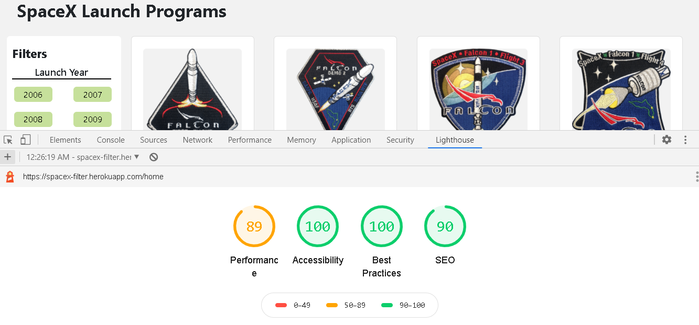

# SpaceX

SpaceX Launch Programs Filter Application

Application is server side rendered with Angular-Universal.  
This project was generated with [Angular CLI](https://github.com/angular/angular-cli) version 10.0.7.

## Heroku Deployment:

## LightHouse Score:

Performance: 89   Accessibility: 100   Best Practices: 100   SEO: 90

## Github Approach:

dev branch is created from Master branch. Seperate branches are created from dev branch for specific features. 

## About Project:

HomeComponent is parent component and CardComponent is child component.   
@ViewChild is used to share data.

Bootstrap 4 is used to achieve Layout and Bootstrap-cards are used.  
Rest is customized SCSS.

Appropriate Semantic tags are used as mentioned in the requirement.

## Responsiveness:-

Responsiveness is specifically taken care for small and medium devices  

Project is responsive for following device configurations:  
Small Devices (Mobile) - 224px to 699px  
Medium Devices (Tablets) - 700px to 1024px  
Large Devices (Desktop) - 1025px to 1440px  
Extra Large Devices - After 1440 px, width will not increase and will be at center as mentioned in the requirement. 
As mentioned in the requirement.

## Functionality:

Filter - On the basis of Launch year, Successful Launch and Successful Landing. 
Url - Url gets updated as per selection of Filters.

## Installation

Run `npm install`.

## Start Project

Run `ng run spaceX:serve-ssr`. Navigate to `http://localhost:4200/`. The app will automatically reload if you change any of the source files.

## Code scaffolding

Run `ng generate component component-name` to generate a new component. You can also use `ng generate directive|pipe|service|class|guard|interface|enum|module`.

## Build

Run `npm run build:ssr` to build the project. The build artifacts will be stored in the `dist/` directory. Use the `--prod` flag for a production build.

## Running unit tests

Run `ng test` to execute the unit tests via [Karma](https://karma-runner.github.io).

## Running end-to-end tests

Run `ng e2e` to execute the end-to-end tests via [Protractor](http://www.protractortest.org/).

## Further help

To get more help on the Angular CLI use `ng help` or go check out the [Angular CLI README](https://github.com/angular/angular-cli/blob/master/README.md).
